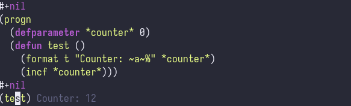

# miik
"Meagre lIsp Interaction mode for Kakoune"

miik is the little brother to SLIME, the Common Lisp Emacs plugin.
It is designed for use within Kakoune, but the protocol is quite simple
and so any script can easily interact with it.

## Usage
Load the `miik` system into your Lisp image, just as you would `swank`

TODO: Explain in more detail how to do this

Then,
```
(miik:start-server)
```
By default, it will listen on `localhost` port `3700`.

Inside Kakoune, load `rc/miik.kak`, and use `:miik-enable-window` to enable it for your window.
Unlike SLIME, The miik protocol is stateless,
and the client automatically sends forms to `miik_host`
(by default `localhost:3700`).
So you don't need to "connect" to anything.

Finally, put your cursor on any Lisp form and use
```
:miik-send-form
```
to send it to the REPL.
miik will display the response in an inline hint.


